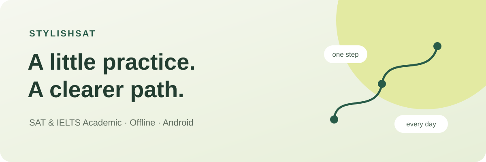
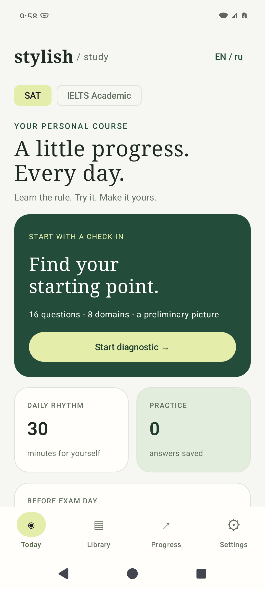
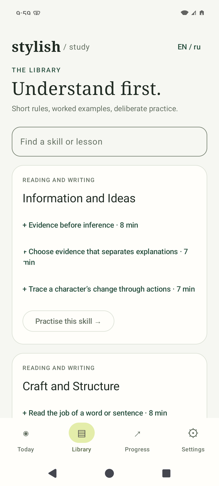
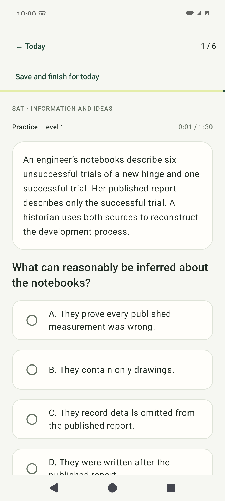

<p align="center"></p>

<p align="center">
  <a href="https://github.com/4wl2d/stylishSAT/releases/latest"></a>
  <a href="https://github.com/4wl2d/stylishSAT/actions/workflows/ci.yml"></a>
  <a href="LICENSE"></a>
  
</p>

<p align="center"><b>Offline SAT & IELTS Academic practice for Android.</b><br>Learn, practise and pick up exactly where you left off.</p>

<p align="center"><a href="https://github.com/4wl2d/stylishSAT/releases/latest">Download APK</a> · <a href="docs/INSTALL.md">Installation</a> · <a href="docs/README.ru.md">Русский</a> · <a href="CHANGELOG.md">Changelog</a></p>

## Your next study session, ready offline

StylishSAT brings short bilingual lessons, English exam-style exercises and your learning history into one local app. Start with a diagnostic, follow a daily course, or choose a focused intensive. Core practice works immediately without an account or an AI model.

| Learn | Practise | Continue |
| --- | --- | --- |
| 48 Russian/English mini-lessons | 810 SAT and IELTS exercises | Saved answers, drafts and progress |
| Worked examples and staged hints | Reading, Listening, Writing, Speaking | Adaptive review and 28-day courses |
| 30 bundled audio recordings/samples | Exact closed-answer checking | Separate SAT and IELTS histories |


<p align="center">
  
  
  
</p>

Screens captured from the signed 0.3.0 release variant on an Android 15 ARM64 emulator.

## Start in a minute

Download the APK from [Releases](https://github.com/4wl2d/stylishSAT/releases/latest) on an Android 10+ ARM64 or x86_64 device. Install it, choose SAT or IELTS Academic and set your study preferences. Start the diagnostic or open the lesson library. See [installation and updates](docs/INSTALL.md), especially if you already use a local debug build.

Optional on-device Gemma and Whisper models add text feedback and speech transcription on eligible ARM64 devices in the 8 GB RAM class. They download separately (~2.74 GB combined). You can also preview, copy or share a prompt to ChatGPT manually. Model feedback stays separate from grading.

## Release scope

**0.3.1 is the first public, signed, installable release.** The learning bank is machine-validated draft content. Independent editorial review, expert AI-quality acceptance and student testing remain pending. StylishSAT does not provide calibrated SAT scores, IELTS bands or pronunciation assessment. Read [content scope](docs/CONTENT.md) and the [release validation record](docs/RELEASE_VALIDATION.md).

No ads, analytics, automatic uploads or cloud sync. Learning data stays in private app storage; uninstalling removes it. [Privacy](docs/PRIVACY.md).

## Build and contribute

```sh
git clone git@github.com:4wl2d/stylishSAT.git
cd stylishSAT
./gradlew :app:testReleaseUnitTest :app:lintRelease :app:assembleRelease
```

JDK 25 and the pinned Android SDK/NDK are required; first builds need internet. Release output is unsigned until the maintainer signs it. The [development guide](docs/DEVELOPMENT.md) covers setup and tests. See [contributing](CONTRIBUTING.md), [versioning](docs/VERSIONING.md), [release procedure](docs/RELEASING.md) and [agent instructions](AGENTS.md).

## License

[MIT](LICENSE) © 2026 4wl2d and contributors. Dependencies and optional models retain their [own licenses and terms](THIRD_PARTY_NOTICES.md). An independent practice project, unaffiliated with the organizations behind SAT or IELTS.
