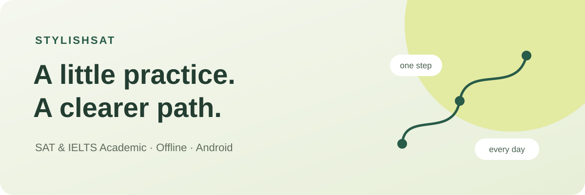
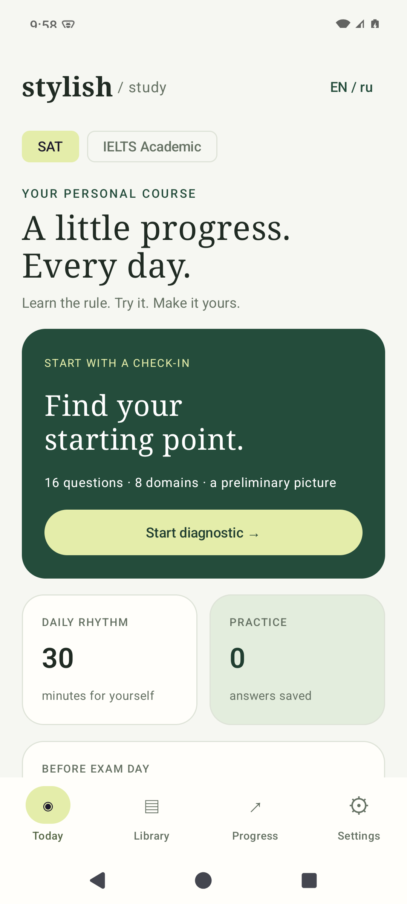
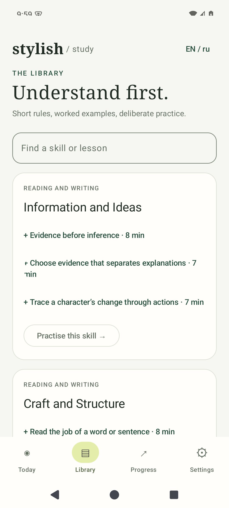
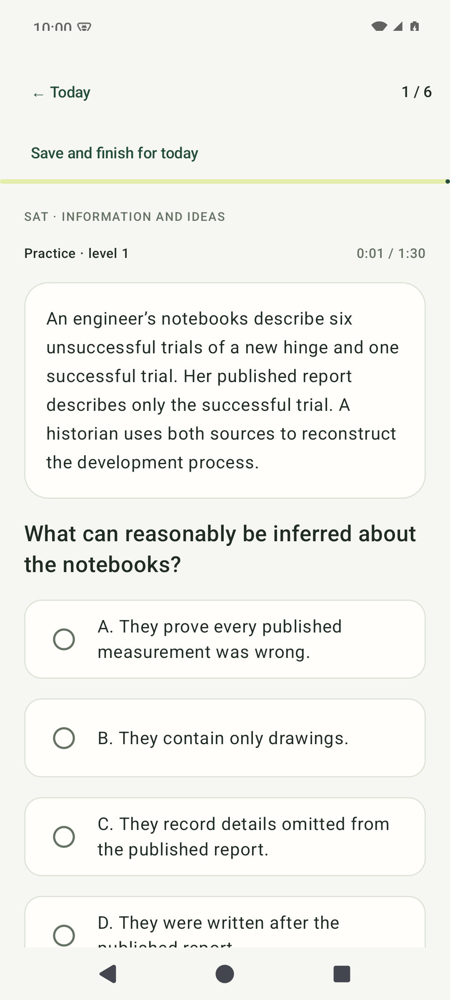

<p align="center"></p>

<p align="center">
  <a href="https://github.com/4wl2d/stylishSAT/releases/latest"></a>
  <a href="https://github.com/4wl2d/stylishSAT/actions/workflows/ci.yml"></a>
  <a href="LICENSE"></a>
  
</p>

<p align="center"><b>Offline SAT & IELTS Academic practice for Android.</b><br>Learn, practise and pick up exactly where you left off.</p>

<p align="center"><a href="https://github.com/4wl2d/stylishSAT/releases/latest">Download APK</a> · <a href="docs/INSTALL.md">Installation</a> · <a href="docs/README.ru.md">Русский</a> · <a href="CHANGELOG.md">Changelog</a></p>

**Source version: 0.4.0.** This README describes the redesigned study flow in the current source. The latest published APK is [0.3.1](https://github.com/4wl2d/stylishSAT/releases/tag/v0.3.1); the 0.4.0 redesign has not been released yet.

## Your next study session, ready offline

StylishSAT brings short bilingual lessons, English exam-style exercises and your learning history into one local app. Today offers one next step: continue a session, take a diagnostic, build or follow a daily route, or work through an intensive. Core practice works immediately without an account or an AI model.

| Learn | Practise | Continue |
| --- | --- | --- |
| 48 Russian/English mini-lessons | 884 SAT and IELTS exercises | Saved answers, drafts and progress |
| Worked examples and staged hints | SAT Reading & Writing / Math; all four IELTS skills; full IELTS sections | Adaptive review and 28-day courses |
| 30 bundled audio recordings/samples | Exact closed-answer checking | Separate SAT and IELTS histories |

Menus, lessons and explanations support English and Russian. Exam prompts and answers stay in English. Writing includes charts and prepared feedback; Speaking supports recording, playback and editable transcripts.

## The study flow

- **First-run setup:** choose English or Russian, SAT or IELTS Academic, and 15, 30, 45 or 60 minutes a day. Start the diagnostic or choose to look around first. Learners with saved study history skip this setup.
- **Today:** a single next action, a weekly activity strip, a streak and saved answer time against your daily goal. Open adaptive practice, a timed check or a 2/4/6-hour intensive; return to unfinished drafts or choose a day in the 28-day route.
- **Study sessions:** step-by-step progress, an exercise clock, answer choices marked after checking, and actions above the keyboard. Close a session to return to Today, or use **More → Save and end for today**. After completing a practice session, the summary offers another round.
- **Library:** search skills and lesson text, open a skill page, read its lessons and launch focused practice. IELTS Reading and Listening pages list full sections: every question for one passage or recording on one page, as practice or under exam conditions (a clock for Reading; one play for Listening).
- **Progress:** independent answer accuracy, a 17-week activity map, skill progress and saved answer history for the selected exam. Activity and minutes come from saved answers.
- **Settings:** daily-minute presets, an exam-date picker, profile goals, optional model downloads, content imports and saved recordings. **About** contains privacy, content-status, grading and license information.

The interface uses a paper-and-ink palette, a highlighter accent and a dark theme that follows the Android system setting.

<details>
<summary>Archived screenshots — 0.3.0 interface</summary>

These screenshots show the earlier interface, captured from the signed 0.3.0 release variant on an Android 15 ARM64 emulator. They predate the 0.4.0 redesign described above.

<p align="center">
  
  
  
</p>

</details>

## Install and start

Download the published APK from [Releases](https://github.com/4wl2d/stylishSAT/releases/latest) on an Android 10+ ARM64 or x86_64 device. See [installation and updates](docs/INSTALL.md), especially if you already use a local debug build. In 0.3.1, choose your exam and study preferences in Settings. To try the redesigned 0.4.0 flow before its release, build this source; its first-run setup leads into the diagnostic or Today.

Lessons, exercises, prepared explanations and bundled audio work without model downloads. Optional on-device Gemma 4 E2B IT and Whisper base.en models add text feedback and speech transcription on eligible ARM64 devices in the 8 GB RAM class. They download separately (~2.74 GB combined). You can also preview, copy or share a prompt to ChatGPT manually and save returned feedback. AI and external feedback never change answer keys, grades or mastery.

## Content, grading and privacy

The learning bank contains AI-authored, machine-validated draft content. Independent editorial review, expert AI-quality acceptance and student testing remain pending. Closed answers are checked deterministically; accuracy and skill progress are training indicators. StylishSAT does not provide calibrated SAT scores, IELTS bands or pronunciation assessment. Read [content scope](docs/CONTENT.md). The [release validation record](docs/RELEASE_VALIDATION.md) documents 0.3.1 and earlier evidence.

No ads, analytics, automatic uploads or cloud sync. Learning data stays in private app storage and is excluded from Android backup. There is no full progress export; uninstalling removes it. [Privacy](docs/PRIVACY.md).

## Build and contribute

```sh
git clone git@github.com:4wl2d/stylishSAT.git
cd stylishSAT
git switch feature/app-redesign-study-flow
mkdir -p build
python3 tools/release/check_repository.py
python3 tools/content/validate_bank.py --report build/content-validation.json
./gradlew :app:testReleaseUnitTest :app:lintRelease :app:assembleRelease
```

While the redesign is in [PR #16](https://github.com/4wl2d/stylishSAT/pull/16), use the feature-branch checkout above. After it is merged, use `main`.

Use JDK 25 and the checked-in Gradle wrapper. The pinned Android components are SDK platform 37.0, Build Tools 37.0.0, NDK 28.2.13676358 and CMake 3.22.1. Set `ANDROID_HOME` or `sdk.dir` in an ignored `local.properties`; first builds need internet. No model is needed for these checks.

Release output is unsigned at `app/build/outputs/apk/release/app-release-unsigned.apk` until the maintainer signs it. For local installation, build `./gradlew :app:assembleDebug`; debug APKs use a different certificate from official releases. The [development guide](docs/DEVELOPMENT.md) covers test-device setup. See [contributing](CONTRIBUTING.md), [versioning](docs/VERSIONING.md), [release procedure](docs/RELEASING.md) and [agent instructions](AGENTS.md).

## License

[MIT](LICENSE) © 2026 4wl2d and contributors. Dependencies and optional models retain their [own licenses and terms](THIRD_PARTY_NOTICES.md). An independent practice project, unaffiliated with the organizations behind SAT or IELTS.
